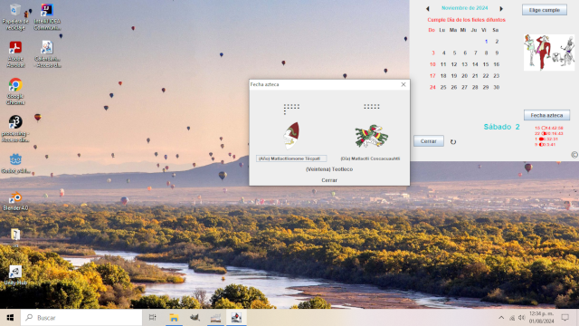

# Calendario para señalar fechas importantes
> (INCLUYE FECHA AZTECA)



Los nombres empleados en la programación sustituyen los comentarios (según yo)

## Sobre el programa

- ```panelMes``` fué pesado porque cada número (*día*) es un ```JButton```
- Incluir la foto es un proceso muy simple en cuanto a formato (lo lamento)
- El formato de las fechas para las fases lunares tampoco es muy sofisticado y están calculadas
  para la Ciudad de México, México. (Se tiene que compilar ```luna.java``` antes de ```CalendarioCumples.java```)
- La fecha azteca se calculó 'igual' que en mis otros calendarios (TeX y HTML con javascript)
- Generé ```CalendarioCumples.exe``` con ```Launch4j``` en *Windows* y lo dejo aquí, aunque
  no recomiendo que lo bajen (tal vez no funcione)

## Sobre los númenes

Son los originales de hace ya un buen. Son de dominio público y están incluídos también en mi repositorio sobre el
[calendario azteca con LaTeX](https://github.com/MiguelNavarroSaad/CalendarioAzteca) y en línea en la
[página de la Universidad Autónoma de Querétaro, Querétaro, México](https://www.uaq.mx/ingenieria/publicaciones/calendarios/calazt.html)
